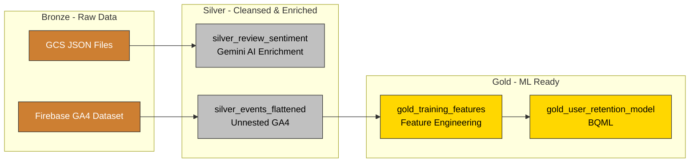
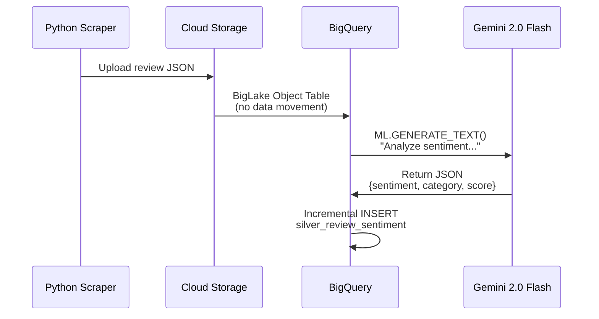
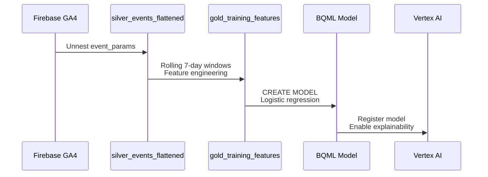

# Data-Cloud: Multimodal Analytics on Google Cloud

> **Showcase:** Bronze/Silver/Gold medallion architecture for multimodal analytics with BigQuery, Gemini AI, and Vertex AI

Combine structured GA4 data with unstructured Play Store reviews using Google Cloud's open lakehouse platform. Predict user churn **and** understand why through AI-powered sentiment analysis.

---

## What You'll Build



**Two data domains:**
- 🧠 **Sentiment Analysis** - Gemini 2.0 Flash analyzes Play Store reviews (multimodal data)
- 📊 **Propensity Modeling** - BigQuery ML predicts user retention from GA4 events

**Key technologies:**
- **BigLake Object Tables** - Query GCS JSON files without ETL
- **Gemini 2.0 Flash** - AI-powered sentiment analysis via SQL
- **BigQuery ML** - In-database logistic regression
- **Dataform** - Git-native SQL transformation
- **Vertex AI** - Model registry and deployment

---

## Quick Start

### Prerequisites

- Google Cloud Project with billing enabled
- `gcloud` CLI authenticated
- Terraform >= 1.6.0
- GitHub personal access token

**Estimated setup time:** 15 minutes
**Estimated cost:** ~$1/month for light usage

---

### 1. Configure Your Project

```bash
# Clone repository
git clone https://github.com/your-org/Data-Cloud.git
cd Data-Cloud

# Configure Terraform
cd infra
cp terraform.tfvars.example terraform.tfvars
# Edit terraform.tfvars with your project_id and github_token

# Configure Dataform
cd ..
cp workflow_settings.yaml.example workflow_settings.yaml
# Edit workflow_settings.yaml with your project_id
```

**📖 Detailed guide:** [Setup Documentation](docs/setup.md)

---

### 2. Deploy Infrastructure

```bash
cd infra
terraform init
terraform apply
```

**What gets created:**
- BigQuery datasets (`sentiment_analysis`, `propensity_modeling`, `ga4_source`)
- GCS bucket for review JSON files
- BigQuery connection for Gemini/BigLake access
- Dataform repository linked to GitHub
- IAM bindings and Secret Manager configuration

**⏱ Time:** ~3-5 minutes

---

### 3. Run the Data Pipeline

1. Open **Google Cloud Console → Dataform**
2. Select `data-cloud` repository
3. Create a development workspace (name must match your branch)
4. Click **Start Compilation** → **Start Execution**

**What gets built:**

| Domain | Objects | Key Outputs |
|--------|---------|-------------|
| **Sentiment** | BigLake Object Table → Gemini enrichment | `silver_review_sentiment` (500+ reviews) |
| **Propensity** | GA4 events → Features → BQML model | `gold_user_retention_model` (registered in Vertex AI) |

**⏱ Time:** ~10-15 minutes (includes BQML training)

---

### 4. Explore the Data

**Sentiment analysis:**
```sql
SELECT sentiment, category, review_text, sentiment_score
FROM `sentiment_analysis.silver_review_sentiment`
WHERE sentiment = 'negative'
ORDER BY sentiment_score ASC
LIMIT 10;
```

**Churn prediction:**
```sql
SELECT
  user_pseudo_id,
  ROUND((SELECT prob FROM UNNEST(predicted_will_return_probs) WHERE label = 1), 3) AS return_probability
FROM ML.PREDICT(
  MODEL `propensity_modeling.gold_user_retention_model`,
  (SELECT * FROM `propensity_modeling.gold_training_features` LIMIT 100)
)
ORDER BY return_probability ASC;
```

**📖 More examples:** [Usage Documentation](docs/usage.md)

---

## Documentation

| Guide | Description |
|-------|-------------|
| **[Setup Guide](docs/setup.md)** | Prerequisites, installation, configuration, troubleshooting |
| **[Architecture Guide](docs/architecture.md)** | Medallion layers, design decisions, data flows, diagrams |
| **[Usage Guide](docs/usage.md)** | SQL query examples, predictions, model evaluation |
| **[CLAUDE.md](CLAUDE.md)** | Development guide for AI assistants |

---

## Key Features

✅ **Bronze/Silver/Gold medallion architecture** on BigQuery
✅ **Domain-driven data mesh** (sentiment_analysis, propensity_modeling)
✅ **Multimodal analytics** - Structured (GA4) + Unstructured (reviews)
✅ **BigLake Object Tables** - Query GCS JSON without data movement
✅ **Gemini AI integration** - Sentiment analysis via SQL
✅ **Incremental processing** - Cost-efficient, only process new data
✅ **BigQuery ML** - In-database model training and prediction
✅ **Vertex AI integration** - Model registry and deployment
✅ **Tag-based workflows** - Selective pipeline execution

---

## Project Structure

```
Data-Cloud/
├── definitions/                      # Dataform SQL pipelines
│   ├── sentiment_analysis/           # Domain 1: Review analysis
│   │   ├── sources/                  # Bronze: BigLake Object Tables
│   │   ├── models/                   # Gemini model references
│   │   └── staging/                  # Silver: AI-enriched reviews
│   └── propensity_modeling/          # Domain 2: User retention
│       ├── sources/                  # Bronze: GA4 declarations
│       ├── staging/                  # Silver: Flattened events
│       ├── marts/                    # Gold: Training features
│       └── ml/                       # Gold: BQML models
├── infra/                            # Terraform IaC
├── scripts/                          # Python review scraper
├── docs/                             # Detailed documentation
└── README.md                         # This file
```

---

## Architecture Highlights

### Medallion Layers

- 🥉 **Bronze** - Raw, immutable (BigLake Object Tables, external declarations)
- 🥈 **Silver** - Cleansed, enriched (Gemini sentiment, unnested GA4 events)
- 🥇 **Gold** - Feature-engineered, ML-ready (training data, models)

### Data Flow: Sentiment Analysis



### Data Flow: Propensity Modeling



**📖 Deep dive:** [Architecture Documentation](docs/architecture.md)

---

## Technology Stack

| Layer | Technology | Purpose |
|-------|------------|---------|
| **Infrastructure** | Terraform | Declarative GCP provisioning |
| **Storage** | BigQuery, GCS | Data warehouse + object storage |
| **Transformation** | Dataform | Git-native SQL pipelines |
| **AI/ML** | Gemini 2.0 Flash, BigQuery ML | Sentiment analysis + retention modeling |
| **Model Management** | Vertex AI | Registry, versioning, deployment |
| **Orchestration** | Dataform Workflows | Tag-based execution |

---

## Source Data

### Sentiment Analysis
- **Source:** Google Play Store (Flood It! game)
- **Format:** JSON files in GCS (one per review)
- **Collection:** Python scraper with checkpoint/resume
- **Volume:** ~500+ reviews with emojis preserved

### Propensity Modeling
- **Source:** Firebase public dataset (`firebase-public-project.analytics_153293282.events_*`)
- **Period:** June 12 - October 3, 2018
- **Volume:** ~5.7M events, ~15K users, ~18K training rows

---

## Cost Estimate

Light usage (development/demo):

- BigQuery storage: ~$0.10/month
- BigQuery queries: ~$0.25/month
- Gemini API calls: ~$0.10 (one-time for 500 reviews)
- GCS storage: <$0.01/month
- **Total: ~$0.50/month**

Production costs depend on:
- Query frequency and data scanned
- Gemini API usage (incremental table minimizes reprocessing)
- Vertex AI endpoint deployment (adds compute costs)

---

## Cleanup

Remove all resources:

```bash
cd infra
terraform destroy
```

**Note:** GCS bucket is preserved by default. Delete manually if needed.

---

## Next Steps

1. **Cross-domain analytics:** Join sentiment with churn predictions
2. **Vertex AI Feature Store:** Register gold tables as online features
3. **Deploy endpoint:** Real-time predictions via REST API
4. **Looker Studio dashboard:** Visualize sentiment trends + churn risk
5. **Production hardening:** Add data quality assertions, monitoring, alerting

**📖 Full roadmap:** [Architecture Documentation](docs/architecture.md#future-enhancements)

---

## Contributing

This project demonstrates Google Cloud capabilities. For production use:

1. Review security best practices in [Setup Guide](docs/setup.md#security-checklist)
2. Add data quality assertions in Dataform
3. Set up Cloud Monitoring alerts
4. Enable VPC Service Controls for sensitive data
5. Use customer-managed encryption keys (CMEK)

---

## License

This project is provided for educational and demonstration purposes.

---

## Resources

- **Google Cloud Documentation:** [BigQuery](https://cloud.google.com/bigquery) | [Gemini](https://cloud.google.com/vertex-ai/docs/generative-ai) | [Dataform](https://cloud.google.com/dataform)
- **Medallion Architecture:** [Databricks Guide](https://www.databricks.com/glossary/medallion-architecture)
- **Data Mesh:** [Thoughtworks Overview](https://www.thoughtworks.com/what-we-do/data-and-ai/data-mesh)
