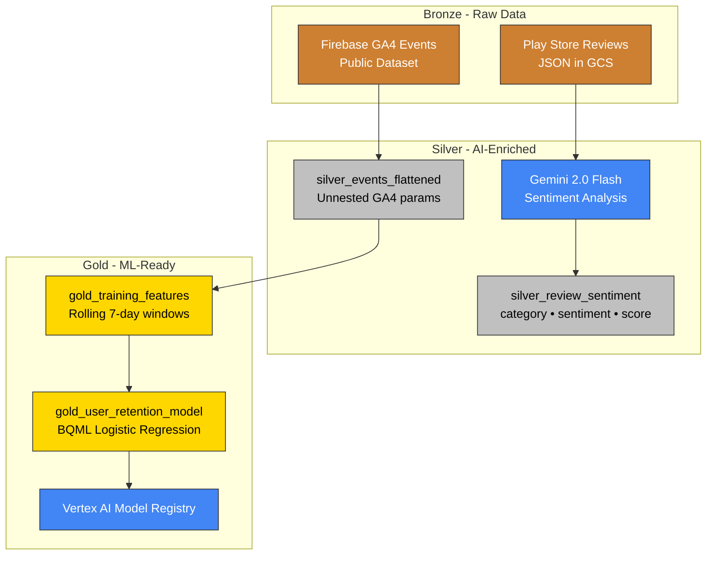

# Multimodal Analytics on Google Cloud

> Predict **which** customers will churn and understand **why** — all in one platform.

Traditional analytics silos behavioral data (structured) from feedback data (unstructured). This showcase demonstrates Google Cloud's open lakehouse architecture for **multimodal analytics**: combining BigQuery ML for churn prediction with Gemini AI for sentiment analysis.

**Result:** Identify high-risk users with negative sentiment for targeted retention campaigns.

---

## Architecture



**Medallion architecture on Google Cloud's open lakehouse:**
- **Bronze** - Raw data in place (BigLake Object Tables, external declarations)
- **Silver** - AI-enriched with Gemini, cleansed for analysis
- **Gold** - ML-ready features and trained models

---

## Key Capabilities

### Query Unstructured Data Without ETL
**BigLake Object Tables** let you query JSON files in Cloud Storage using SQL — no data movement required.

```sql
-- Query raw reviews directly from GCS
SELECT SAFE_CONVERT_BYTES_TO_STRING(data) AS review_json
FROM `sentiment_analysis.bronze_user_reviews`
LIMIT 5;
```

### AI Enrichment in SQL
**Gemini 2.0 Flash** analyzes sentiment via SQL using `ML.GENERATE_TEXT()` — no external API orchestration.

```sql
-- Gemini extracts sentiment, category, and score
SELECT review_text, sentiment, category, sentiment_score
FROM `sentiment_analysis.silver_review_sentiment`
WHERE sentiment = 'negative'
ORDER BY sentiment_score ASC;
```

### Train ML Models Where Data Lives
**BigQuery ML** trains models on billions of rows without moving data — from SQL to production-ready model in minutes.

```sql
-- Logistic regression trained on 18K rows
CREATE MODEL gold_user_retention_model
OPTIONS(model_type='LOGISTIC_REG', model_registry='vertex_ai')
AS SELECT * FROM gold_training_features;
```

### Infrastructure as Code
**Terraform + Dataform** provision infrastructure and build pipelines declaratively.

---

## Try It Yourself

### Quick Deploy
```bash
# 1. Configure
cp infra/terraform.tfvars.example infra/terraform.tfvars
# Edit with your project_id and github_token

# 2. Deploy infrastructure
cd infra && terraform apply

# 3. Run pipeline (via Dataform UI)
# Google Cloud Console → Dataform → Start Execution
```

**Step-by-step guide:** [Getting Started](docs/getting-started.md)

---

## What You'll Build

| Use Case | Input | Output | Services |
|----------|-------|--------|----------|
| **Churn Prediction** | 5.7M GA4 events | Risk scores (0-100%) | BigQuery ML, Vertex AI |
| **Sentiment Analysis** | 500+ Play Store reviews | Sentiment + category | BigLake, Gemini 2.0 Flash |
| **Multimodal Insights** | Churn + Sentiment | Targeted interventions | BigQuery joins |

**Cross-domain insight:** Join sentiment with churn risk to identify users who are *both* high-risk *and* frustrated.

*Also includes [Campaign Intelligence](docs/demos/campaign-intelligence/) (proof of concept) — target campaigns using public Census data without customer PII.*

---

## Documentation

| Guide | Description |
|-------|-------------|
| **[Getting Started](docs/getting-started.md)** | Deploy infrastructure and run your first pipeline |
| **[Guides](docs/demos/README.md)** | Step-by-step walkthroughs with SQL examples |
| **[Architecture Deep Dive](docs/architecture.md)** | Medallion layers, design decisions, technical details |

---

## Technologies

**Google Cloud native stack:**
- **BigQuery** - Serverless data warehouse
- **BigLake** - Query GCS data without ETL
- **Gemini 2.0 Flash** - Multimodal AI via SQL
- **BigQuery ML** - In-database ML training
- **Vertex AI** - Model registry and deployment
- **Dataform** - Git-native SQL transformation
- **Terraform** - Infrastructure as Code

---

## Project Structure

```
Data-Cloud/
├── definitions/                  # Dataform SQL pipelines
│   ├── propensity_modeling/      #   Churn prediction (BQML)
│   ├── sentiment_analysis/       #   Review analysis (Gemini)
│   └── campaign_intelligence/    #   Campaign targeting (proof of concept)
├── infra/                        # Terraform IaC
├── scripts/                      # Review scraper
└── docs/
    ├── getting-started.md
    ├── architecture.md
    └── demos/                    # Use case guides
        ├── churn-prediction/
        ├── sentiment-analysis/
        ├── multimodal-insights/
        └── campaign-intelligence/
```

---

## Next Steps

1. **Deploy:** Follow [Getting Started](docs/getting-started.md)
2. **Explore:** Run the [Guides](docs/demos/README.md)
3. **Extend:** Add new features to the ML model
4. **Productionize:** Deploy to Vertex AI endpoint for real-time scoring

---

## License

This project is provided for educational and demonstration purposes.
