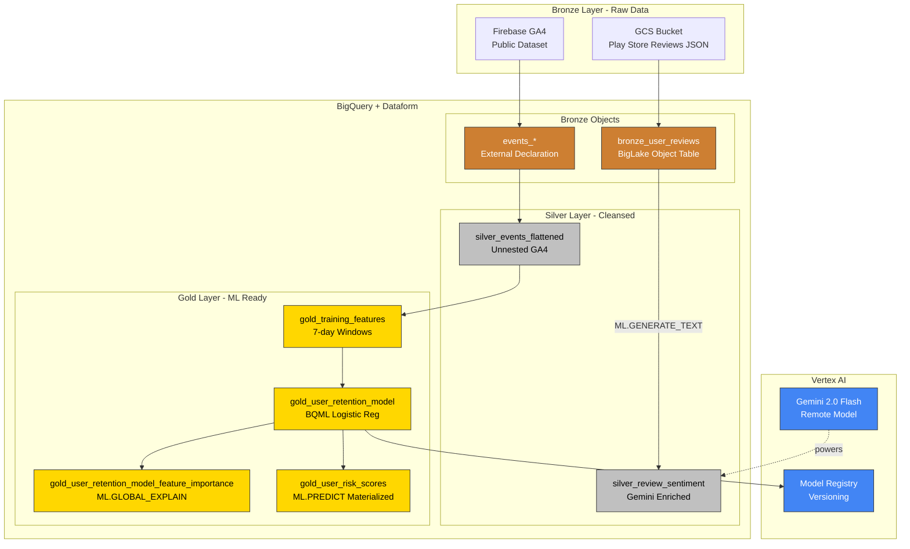
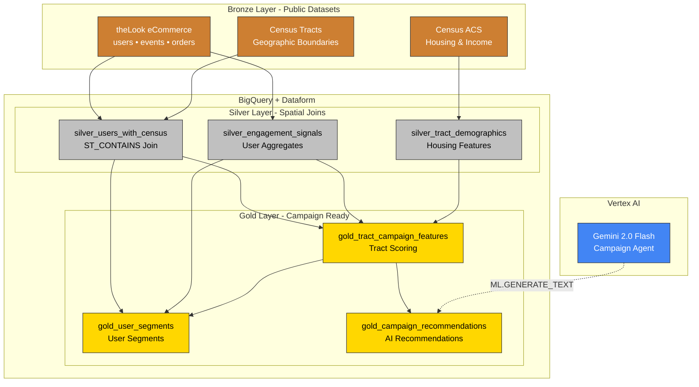
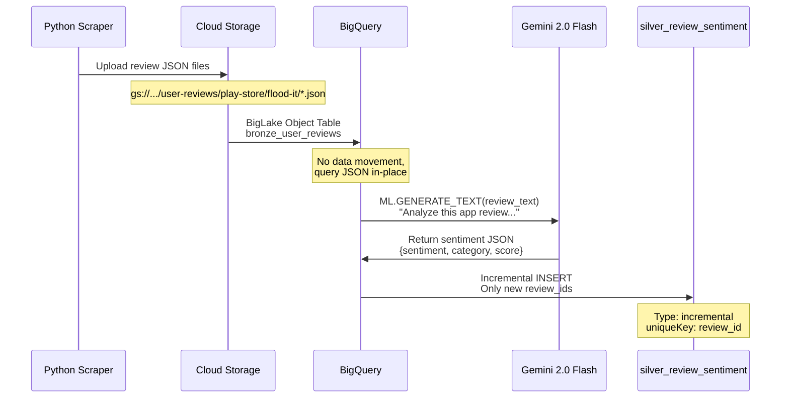
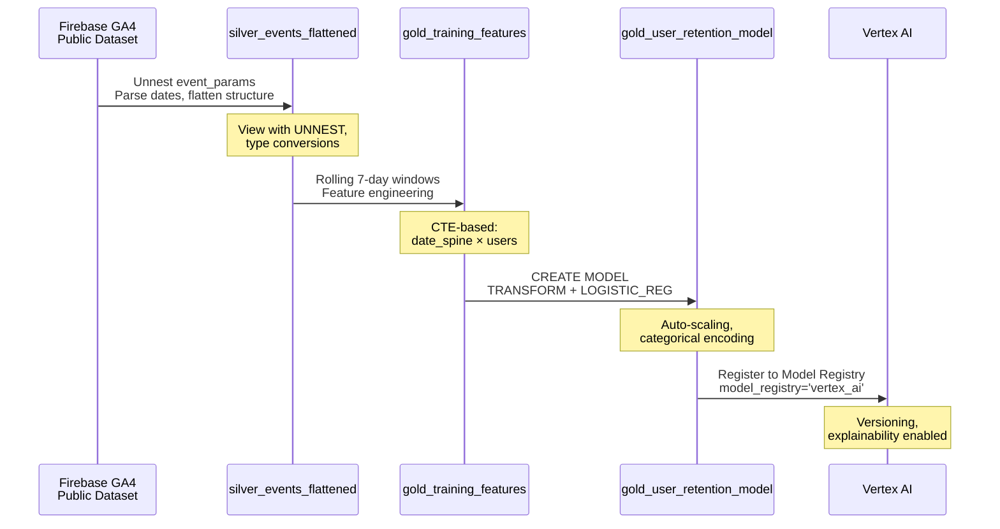
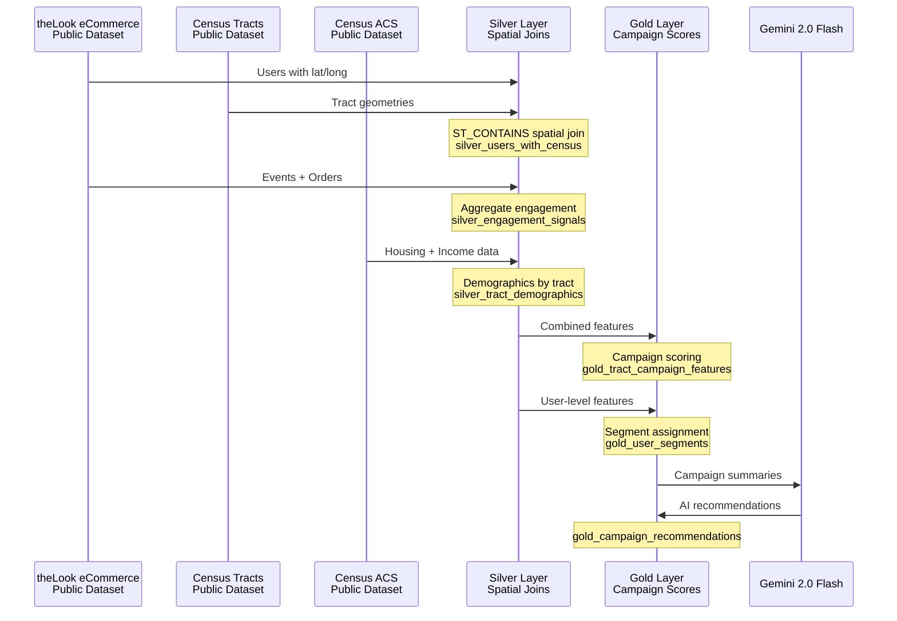

# Architecture Deep Dive

This document explains the technical architecture, design decisions, and data flow patterns in the Data-Cloud project.

---

## Architecture Overview

### Sentiment Analysis & Propensity Modeling



### Campaign Intelligence *(Proof of Concept)*



**Campaign Intelligence Pipeline:**
- **Bronze** - Declarations for 3 public datasets (theLook eCommerce, Census tracts, Census ACS)
- **Silver** - Spatial joins (ST_CONTAINS), engagement aggregation, demographic features
- **Gold** - Campaign scoring by census tract, user segmentation, Gemini-generated recommendations

---

## Data Flow: Sentiment Analysis Domain



---

## Data Flow: Propensity Modeling Domain



---

## Data Flow: Campaign Intelligence Domain *(Proof of Concept)*



---

## Medallion Architecture Explained

This project follows the **bronze/silver/gold pattern** popularized by modern data lakehouses.

### Bronze Layer - Raw, Immutable

**Purpose:** Landing zone for raw data exactly as-is

**Characteristics:**
- No transformations or data quality checks
- Append-only (immutable)
- Full audit trail and reprocessing capability
- Preserves original data formats

**Implementation:**
- `bronze_user_reviews` - BigLake Object Table pointing to GCS JSON files
- `events_*` - External declaration for Firebase GA4 dataset

---

### Silver Layer - Cleansed, Validated

**Purpose:** Business-ready data with quality checks and enrichment

**Characteristics:**
- Type conversions (BYTES → STRING, date parsing)
- Unnesting of nested/repeated fields
- Null handling with COALESCE
- AI enrichment (Gemini sentiment analysis)
- Deduplication via incremental processing

**Implementation:**
- `silver_review_sentiment` - Incremental table with Gemini-enriched reviews
- `silver_events_flattened` - View that unnests GA4 event_params array

---

### Gold Layer - Feature-Engineered, Analytics-Ready

**Purpose:** ML-ready features and business aggregations

**Characteristics:**
- Feature engineering (rolling windows, aggregations)
- Dimensional modeling for analytics
- ML training datasets with features + labels
- Trained models and predictions

**Implementation:**
- `gold_training_features` - 7-day rolling window features with labels
- `gold_user_retention_model` - BQML logistic regression model

---

## Data Mesh with Domain Ownership

```
definitions/
├── sentiment_analysis/          # Domain 1: Review analysis
│   ├── sources/                # Bronze layer
│   ├── models/                 # AI models
│   └── staging/                # Silver layer
│
├── propensity_modeling/        # Domain 2: User retention
│   ├── sources/                # Bronze layer
│   ├── staging/                # Silver layer
│   ├── marts/                  # Gold layer
│   └── ml/                     # Gold layer (models)
│
└── campaign_intelligence/      # Domain 3: Campaign targeting
    ├── sources/                # Bronze layer (Census + theLook)
    ├── staging/                # Silver layer (spatial joins)
    ├── marts/                  # Gold layer (scoring)
    └── models/                 # Gold layer (Gemini agent)
```

---

## Feature Engineering Strategy

The propensity model uses **rolling 7-day windows** instead of static "first 7 days":

### Traditional Approach (Not Recommended)
```
User A: Days 1-7 → Will they return on Day 8?
(Single training row per user)
```

### Our Approach
```
User A, Week 1: Days 1-7   → Did they return Days 8-14?
User A, Week 2: Days 8-14  → Did they return Days 15-21?
User A, Week 3: Days 15-21 → Did they return Days 22-28?
(Multiple training rows per user)
```

**Why?**
1. **More training data**: ~18K rows instead of ~15K
2. **Temporal dynamics**: Captures how behavior changes over time
3. **Continuous prediction**: Can score users at any point in their lifecycle
4. **Realistic labels**: Based on actual future behavior

---

## BigLake Object Tables

Traditional approach: **ETL (Extract-Transform-Load)**
```
GCS JSON → Load to BigQuery → Transform → Query
```

Our approach: **ELT with BigLake (Extract-Load-Transform)**
```
GCS JSON (stays in place) → BigQuery queries directly → Transform in SQL
```

**Benefits:**
1. **No data movement**: Query GCS files directly via SQL
2. **Efficiency**: Query data in place, no storage duplication
3. **Simplicity**: No ETL pipelines to maintain
4. **Freshness**: Changes in GCS reflected automatically

---

## Gemini AI Integration

Gemini 2.0 Flash is accessed as a **remote model** in BigQuery:

```sql
-- 1. Create remote model connection
CREATE OR REPLACE MODEL gemini_sentiment_model
  REMOTE WITH CONNECTION `US.vertex-ai-connection`
  OPTIONS (endpoint = 'gemini-2.0-flash-001');

-- 2. Use in SQL query
SELECT *
FROM ML.GENERATE_TEXT(
  MODEL sentiment_analysis.gemini_sentiment_model,
  (SELECT uri, data_string, CONCAT('...') AS prompt FROM bronze_user_reviews),
  STRUCT(0.2 AS temperature, 1024 AS max_output_tokens, TRUE AS flatten_json_output)
);
```

---

## Incremental Processing

The `silver_review_sentiment` table uses Dataform's incremental mode:

```javascript
config {
  type: "incremental",
  uniqueKey: ["review_id"]
}
```

**How it works:**
1. First run: Processes all reviews
2. Subsequent runs: Only new reviews not in the target table
3. Deduplication: Uses `uniqueKey` to prevent duplicates

---

## Technology Stack

| Component | Technology | Purpose |
|-----------|------------|---------|
| **Infrastructure** | Terraform 1.6+ | Declarative GCP resource provisioning |
| **Data Warehouse** | BigQuery | Serverless SQL analytics and storage |
| **Object Storage** | Cloud Storage (GCS) | Unstructured data (JSON reviews) |
| **Multimodal Data** | BigLake Object Tables | Query GCS files without data movement |
| **AI/ML** | Gemini 2.0 Flash | Multimodal sentiment analysis |
| **ML Training** | BigQuery ML | In-database logistic regression |
| **Model Management** | Vertex AI | Model registry, versioning, deployment |
| **Data Transformation** | Dataform 3.0 | SQL-based ETL with Git integration |

---

## Design Decisions

### Why BigQuery instead of a traditional lakehouse?

1. **Serverless**: No clusters to manage or tune
2. **Separation of storage/compute**: Pay only for what you use
3. **Integrated AI**: Gemini models via SQL
4. **BigLake**: Query GCS data without ETL
5. **Google Cloud native**: Tight integration with Vertex AI, Dataform

### Why Dataform instead of dbt or Apache Airflow?

1. **Managed service**: No infrastructure to maintain
2. **Git-native**: Direct GitHub integration
3. **BigQuery optimized**: Uses SCRIPT, MERGE, CREATE OR REPLACE efficiently
4. **Tag-based workflows**: Run subsets of pipeline

### Why Gemini 2.0 Flash?

1. **Multimodal**: Can analyze text, images, and video
2. **Fast**: Flash variant optimized for speed
3. **BigQuery integration**: No external API orchestration
4. **Structured output**: Native JSON parsing

---

## Related Documentation

- [Getting Started](../getting-started.md) - Installation and configuration
- [Demo Guides](../demos/README.md) - Step-by-step demonstrations
- [CLAUDE.md](../../CLAUDE.md) - Development guide
