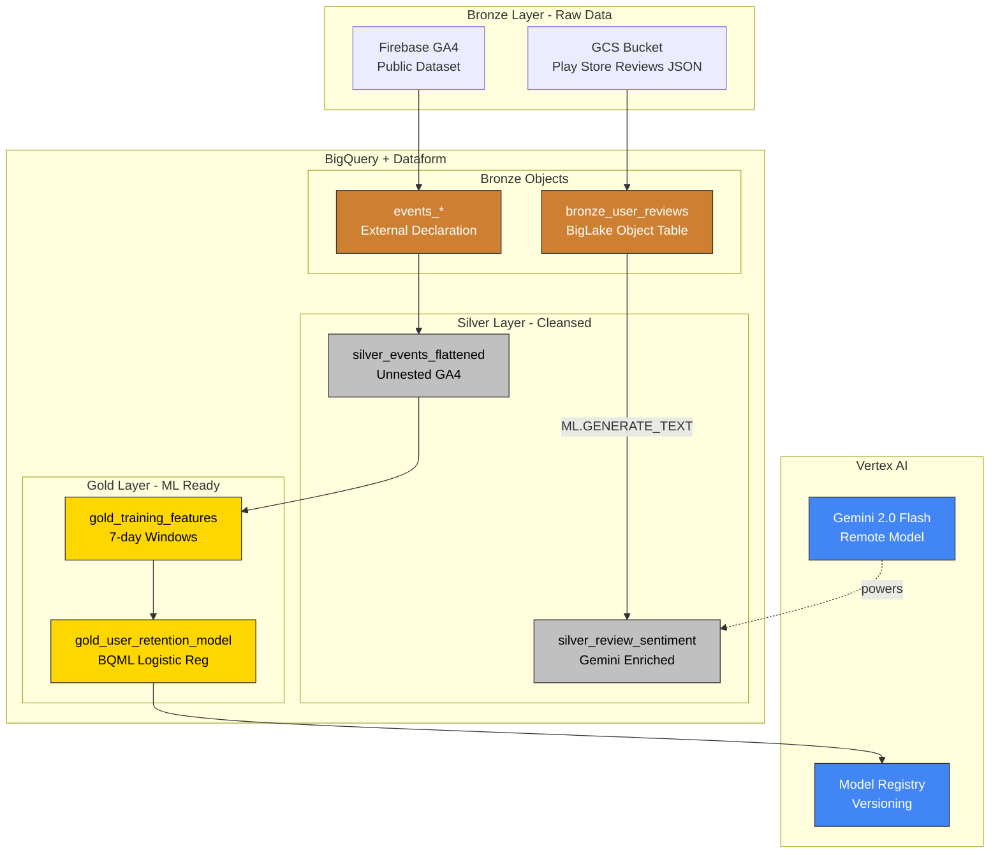
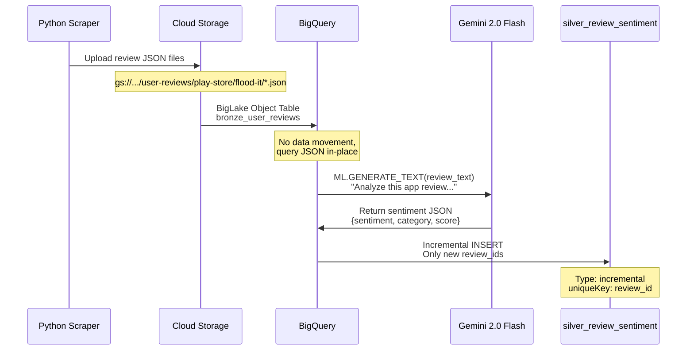
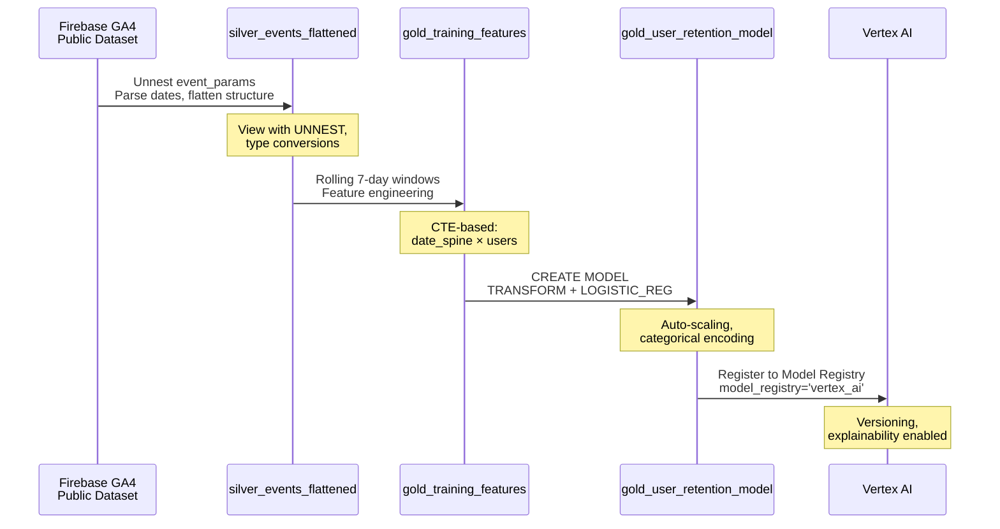

# Architecture Deep Dive

This document explains the technical architecture, design decisions, and data flow patterns in the Data-Cloud project.

---

## Architecture Overview



---

## Data Flow: Sentiment Analysis Domain



---

## Data Flow: Propensity Modeling Domain



---

## Medallion Architecture Explained

This project follows the **bronze/silver/gold pattern** popularized by modern data lakehouses.

### Bronze Layer - Raw, Immutable

**Purpose:** Landing zone for raw data exactly as-is

**Characteristics:**
- No transformations or data quality checks
- Append-only (immutable)
- Full audit trail and reprocessing capability
- Preserves original data formats

**Implementation:**
- `bronze_user_reviews` - BigLake Object Table pointing to GCS JSON files
- `events_*` - External declaration for Firebase GA4 dataset

**Naming convention:** `bronze_*` prefix

---

### Silver Layer - Cleansed, Validated

**Purpose:** Business-ready data with quality checks and enrichment

**Characteristics:**
- Type conversions (BYTES → STRING, date parsing)
- Unnesting of nested/repeated fields
- Null handling with COALESCE
- AI enrichment (Gemini sentiment analysis)
- Deduplication via incremental processing

**Implementation:**
- `silver_review_sentiment` - Incremental table with Gemini-enriched reviews
- `silver_events_flattened` - View that unnests GA4 event_params array
- `silver_user_sessions` - Session-level aggregations

**Naming convention:** `silver_*` prefix

---

### Gold Layer - Feature-Engineered, Analytics-Ready

**Purpose:** ML-ready features and business aggregations

**Characteristics:**
- Feature engineering (rolling windows, aggregations)
- Dimensional modeling for analytics
- ML training datasets with features + labels
- Trained models and predictions

**Implementation:**
- `gold_training_features` - 7-day rolling window features with labels
- `gold_user_retention_model` - BQML logistic regression model

**Naming convention:** `gold_*` prefix

---

## Data Mesh with Domain Ownership

We combine medallion layers (bronze/silver/gold) with data mesh domains:

```
definitions/
├── sentiment_analysis/          # Domain 1: Review analysis
│   ├── sources/                # Bronze layer
│   ├── models/                 # AI models
│   └── staging/                # Silver layer
│
└── propensity_modeling/        # Domain 2: User retention
    ├── sources/                # Bronze layer
    ├── staging/                # Silver layer
    ├── marts/                  # Gold layer
    └── ml/                     # Gold layer (models)
```

**Benefits:**
- Clear ownership boundaries
- Domain-specific optimization
- Independent scaling and deployment
- Cross-domain analytics via joins

**Future domain:** `analytics/` for cross-domain insights (sentiment + propensity)

---

## Feature Engineering Strategy

The propensity model uses **rolling 7-day windows** instead of static "first 7 days":

### Traditional Approach (Not Recommended)
```
User A: Days 1-7 → Will they return on Day 8?
(Single training row per user)
```

### Our Approach
```
User A, Week 1: Days 1-7   → Did they return Days 8-14?
User A, Week 2: Days 8-14  → Did they return Days 15-21?
User A, Week 3: Days 15-21 → Did they return Days 22-28?
(Multiple training rows per user)
```

**Why?**
1. **More training data**: ~18K rows instead of ~15K
2. **Temporal dynamics**: Captures how behavior changes over time
3. **Continuous prediction**: Can score users at any point in their lifecycle
4. **Realistic labels**: Based on actual future behavior, not hypothetical

**Implementation in `gold_training_features.sqlx`:**
```sql
WITH date_spine AS (
  -- Generate observation dates every 7 days
  SELECT observation_date
  FROM UNNEST(GENERATE_DATE_ARRAY('2018-07-01', '2018-09-15', INTERVAL 7 DAY))
),
user_training_features AS (
  -- Features: 7 days BEFORE observation_date
  SELECT ...
  FROM user_observations uo
  LEFT JOIN silver_events_flattened e
    ON uo.user_pseudo_id = e.user_pseudo_id
    AND e.event_date BETWEEN DATE_SUB(uo.observation_date, INTERVAL 7 DAY)
                         AND DATE_SUB(uo.observation_date, INTERVAL 1 DAY)
),
user_future_activity AS (
  -- Label: Did user return in 7 days AFTER observation_date?
  SELECT ...
  WHERE e.event_date BETWEEN uo.observation_date
                         AND DATE_ADD(uo.observation_date, INTERVAL 7 DAY)
)
```

---

## BigLake Object Tables

Traditional approach: **ETL (Extract-Transform-Load)**
```
GCS JSON → Load to BigQuery → Transform → Query
```

Our approach: **ELT with BigLake (Extract-Load-Transform)**
```
GCS JSON (stays in place) → BigQuery queries directly → Transform in SQL
```

**Benefits:**
1. **No data movement**: Query GCS files directly via SQL
2. **Efficiency**: Query data in place, no storage duplication
3. **Simplicity**: No ETL pipelines to maintain
4. **Freshness**: Changes in GCS reflected automatically (metadata cache)

**Configuration in `bronze_user_reviews.sqlx`:**
```sql
CREATE OR REPLACE EXTERNAL TABLE bronze_user_reviews
WITH CONNECTION `US.vertex-ai-connection`
OPTIONS (
  object_metadata = 'SIMPLE',
  uris = ['gs://.../user-reviews/play-store/flood-it/*.json'],
  max_staleness = INTERVAL 1 HOUR,
  metadata_cache_mode = 'AUTOMATIC'
);
```

**Note:** Requires a BigQuery connection with GCS read permissions.

---

## Gemini AI Integration

Gemini 2.0 Flash is accessed as a **remote model** in BigQuery:

```sql
-- 1. Create remote model connection
CREATE OR REPLACE MODEL gemini_sentiment_model
  REMOTE WITH CONNECTION `US.vertex-ai-connection`
  OPTIONS (endpoint = 'gemini-2.0-flash-001');

-- 2. Use in SQL query
SELECT *
FROM ML.GENERATE_TEXT(
  MODEL sentiment_analysis.gemini_sentiment_model,
  (
    SELECT
      uri,
      data_string,
      CONCAT(
        'Analyze this app review and return ONLY a valid JSON object...',
        '\n\nReview: "', data_string, '"'
      ) AS prompt
    FROM bronze_user_reviews
  ),
  STRUCT(
    0.2 AS temperature,
    1024 AS max_output_tokens,
    TRUE AS flatten_json_output
  )
);
```

**Key features:**
- **Structured output**: `flatten_json_output=TRUE` parses JSON responses
- **Low temperature**: `0.2` for consistent, deterministic results
- **Incremental processing**: Only processes new reviews (via uniqueKey)
- **Efficiency**: Processes reviews once, stores results

---

## Incremental Processing

The `silver_review_sentiment` table uses Dataform's incremental mode:

```javascript
config {
  type: "incremental",
  uniqueKey: ["review_id"]
}
```

**How it works:**
1. First run: Processes all reviews
2. Subsequent runs: Only new reviews not in the target table
3. Deduplication: Uses `uniqueKey` to prevent duplicates

**SQL implementation:**
```sql
WHERE JSON_EXTRACT_SCALAR(data_string, '$.review_id') NOT IN (
  SELECT review_id FROM ${self()}
)
```

**Benefits:**
- Efficiency (Gemini API calls only for new data)
- Faster execution (skip already-processed reviews)
- Idempotency (safe to re-run)

---

## Project Structure

```
.
├── infra/                              # Terraform IaC
│   ├── main.tf                         # All GCP resources
│   ├── variables.tf                    # Input variables
│   └── terraform.tfvars.example        # Config template
│
├── scripts/                            # Data collection
│   ├── scrape_play_store_reviews.py    # Review scraper with checkpointing
│   └── requirements.txt                # Python dependencies
│
├── definitions/                        # Dataform SQL pipeline
│   ├── sentiment_analysis/
│   │   ├── sources/
│   │   │   └── bronze_user_reviews.sqlx          # BigLake Object Table
│   │   ├── models/
│   │   │   └── gemini_sentiment_model.sqlx       # Remote Gemini model
│   │   └── staging/
│   │       └── silver_review_sentiment.sqlx      # Gemini-enriched (incremental)
│   │
│   └── propensity_modeling/
│       ├── sources/
│       │   └── ga4_events.sqlx                   # External GA4 declaration
│       ├── staging/
│       │   ├── silver_events_flattened.sqlx      # Unnested GA4 events
│       │   └── silver_user_sessions.sqlx         # Session aggregations
│       ├── marts/
│       │   └── gold_training_features.sqlx       # 7-day rolling windows
│       └── ml/
│           ├── gold_user_retention_model.sqlx    # BQML logistic regression
│           ├── predictions.sqlx                  # Example prediction queries
│           └── model_evaluation.sqlx             # Model evaluation queries
│
├── docs/                               # Documentation
│   ├── getting-started.md              # Installation and configuration
│   ├── demo-walkthrough.md             # Step-by-step demonstration
│   ├── architecture.md                 # This file
│   └── demo-walkthrough.md             # Step-by-step demo with SQL examples
│
├── package.json                        # Dataform dependencies
├── workflow_settings.yaml              # Dataform project config
├── CLAUDE.md                           # AI assistant context
└── README.md                           # Quick start guide
```

---

## Technology Stack

| Component | Technology | Purpose |
|-----------|------------|---------|
| **Infrastructure** | Terraform 1.6+ | Declarative GCP resource provisioning |
| **Data Warehouse** | BigQuery | Serverless SQL analytics and storage |
| **Object Storage** | Cloud Storage (GCS) | Unstructured data (JSON reviews) |
| **Multimodal Data** | BigLake Object Tables | Query GCS files without data movement |
| **AI/ML** | Gemini 2.0 Flash | Multimodal sentiment analysis |
| **ML Training** | BigQuery ML | In-database logistic regression |
| **Model Management** | Vertex AI | Model registry, versioning, deployment |
| **Data Transformation** | Dataform 3.0 | SQL-based ETL with Git integration |
| **Orchestration** | Dataform Workflows | Scheduled execution with tag-based selection |
| **Secrets** | Secret Manager | Secure GitHub token storage |
| **Review Collection** | Python + google-play-scraper | Automated review scraping |

---

## Source Data

### Sentiment Analysis Domain

**Source:** Google Play Store reviews for "Flood It!" game

**Collection method:** Python scraper (`scripts/scrape_play_store_reviews.py`)

**Storage:** GCS bucket `{project}-multimodal-data/user-reviews/play-store/flood-it/`

**Format:** One JSON file per review
```json
{
  "platform": "play-store",
  "review_id": "unique-id",
  "user_name": "John Doe",
  "review_text": "🎮 Love this game!",
  "rating": 5,
  "review_date": "2018-06-20",
  "app_version": "2.98",
  "thumbs_up_count": 12,
  "scraped_at": "2026-02-04T21:41:05Z"
}
```

**Features:**
- Unicode/emoji preservation
- Checkpoint/resume capability for long scrapes
- Automatic upload to GCS via Terraform-generated `.env`

---

### Propensity Modeling Domain

**Source:** Firebase public dataset - Flood It! game

**Dataset:** `firebase-public-project.analytics_153293282.events_*`

**Date range:** June 12, 2018 – October 3, 2018 (114 days)

**Volume:**
- ~5.7M raw GA4 events
- ~15K unique users
- ~18K training rows after feature engineering

**Event types:**
- `user_engagement` - Session duration
- `level_start`, `level_complete`, `level_fail` - Gameplay
- `post_score` - Score events
- Device/geo metadata in event_params

---

## Design Decisions

### Why BigQuery instead of a traditional lakehouse (Databricks/Snowflake)?

1. **Serverless**: No clusters to manage or tune
2. **Separation of storage/compute**: Pay only for what you use
3. **Integrated AI**: Gemini models via SQL (no external API orchestration)
4. **BigLake**: Query GCS data without ETL
5. **Google Cloud native**: Tight integration with Vertex AI, Dataform, Secret Manager

### Why Dataform instead of dbt or Apache Airflow?

1. **Managed service**: No infrastructure to maintain
2. **Git-native**: Direct GitHub integration, no webhooks
3. **BigQuery optimized**: Uses SCRIPT, MERGE, CREATE OR REPLACE efficiently
4. **Tag-based workflows**: Run subsets of pipeline (e.g., just sentiment_analysis domain)
5. **Google Cloud native**: Built by Google, first-class BigQuery support

### Why Gemini 2.0 Flash instead of other models?

1. **Multimodal**: Can analyze text, images, video in future expansions
2. **Fast**: Flash variant optimized for speed and throughput
3. **BigQuery integration**: No external API orchestration needed
4. **Structured output**: Native JSON parsing with `flatten_json_output`
5. **Google Cloud native**: Managed through Vertex AI

### Why rolling windows instead of static cohorts?

1. **More training data**: Multiple rows per user vs. one
2. **Temporal patterns**: Captures how behavior changes over time
3. **Continuous scoring**: Can predict churn at any lifecycle stage
4. **Production-ready**: Mirrors real-world usage (score users periodically)

---

## Future Enhancements

### Cross-Domain Analytics
Create `analytics/` domain to join sentiment and propensity:
```sql
-- gold_user_360.sqlx
SELECT
  p.user_pseudo_id,
  p.return_probability,
  p.risk_category,
  s.avg_sentiment_score,
  s.negative_review_count
FROM propensity_modeling.gold_predictions p
LEFT JOIN sentiment_analysis.gold_user_sentiment_summary s
  ON p.user_pseudo_id = s.user_pseudo_id;
```

### Vertex AI Feature Store
Register gold tables as online features for low-latency serving:
```python
from google.cloud import aiplatform

feature_store = aiplatform.FeatureStore.create(
    featurestore_id="user_features",
    online_store_fixed_node_count=1,
)

entity_type = feature_store.create_entity_type(
    entity_type_id="user",
    description="User entity with retention features",
)

entity_type.batch_create_features(
    feature_configs={
        "days_active": {"value_type": "INT64"},
        "level_completion_rate": {"value_type": "DOUBLE"},
        # ... more features
    }
)
```

### Real-Time Predictions
Deploy model to Vertex AI Endpoint for REST API access:
```bash
gcloud ai endpoints deploy-model ENDPOINT_ID \
  --region=us-central1 \
  --model=gold_user_retention_model \
  --display-name=user-retention-v1 \
  --machine-type=n1-standard-2 \
  --min-replica-count=1 \
  --max-replica-count=3
```

### Data Quality Assertions
Add assertions in Dataform to validate data quality:
```javascript
// assertions/silver_review_sentiment_tests.sqlx
config { type: "assertion" }

SELECT *
FROM ${ref("silver_review_sentiment")}
WHERE sentiment NOT IN ('positive', 'neutral', 'negative')
  OR sentiment_score NOT BETWEEN -1 AND 1;
```

---

## Related Documentation

- [Getting Started](getting-started.md) - Installation and configuration
- [Demo Walkthrough](demo-walkthrough.md) - Step-by-step demonstration
- [Demo Walkthrough](demo-walkthrough.md) - Step-by-step demonstration with SQL examples
- [CLAUDE.md](../CLAUDE.md) - Development guide for AI assistants
- [GEMINI.md](../GEMINI.md) - Project context for AI assistants
