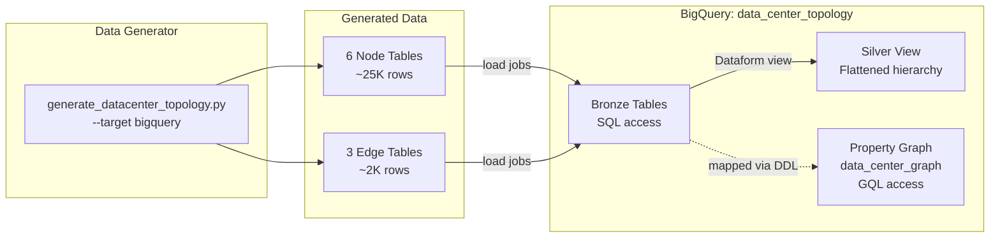
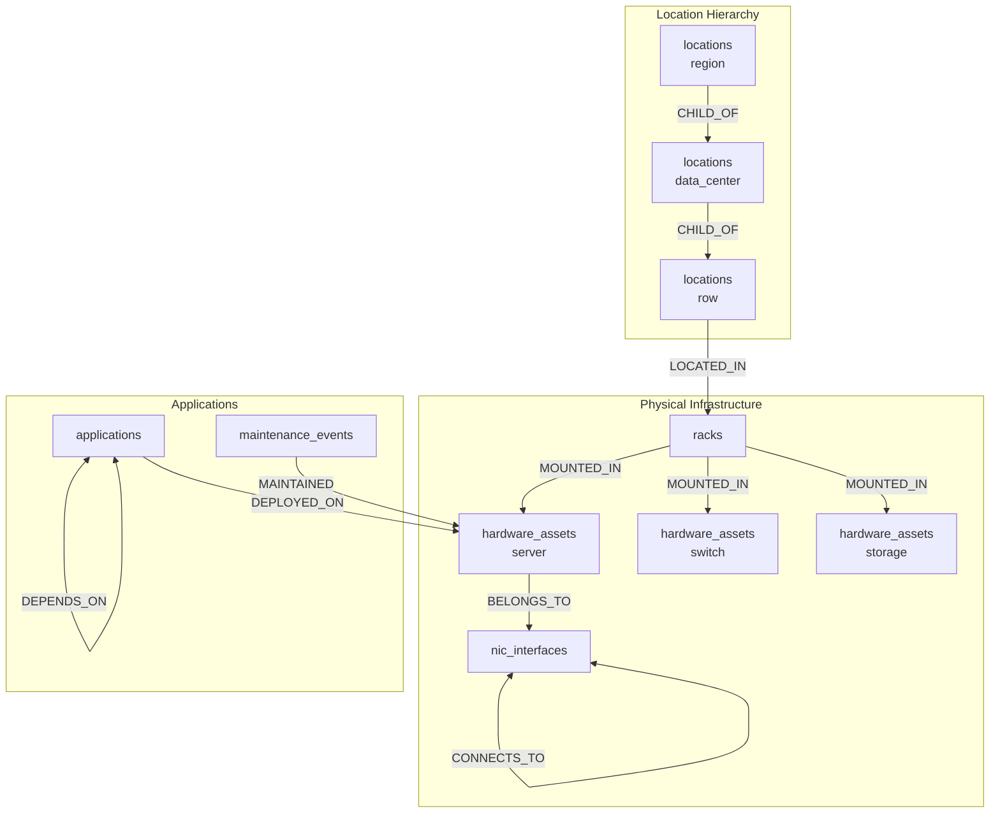

# BQ Graph Architecture

## Overview

This demo uses BigQuery property graph to model data center infrastructure as a graph, enabling GQL queries for impact analysis and dependency tracing. The property graph is a metadata overlay — no data is copied or moved.

## Data Flow

## Graph Schema

## Node Tables

| Table | Primary Key | Description | Sample Size |
|-------|-------------|-------------|-------------|
| `locations` | `location_id` | Hierarchical locations (regions, DCs, rows) | ~50 |
| `racks` | `rack_id` | Physical rack units | ~500 |
| `hardware_assets` | `asset_id` | Servers, switches, storage | ~4,700 |
| `nic_interfaces` | `interface_id` | Network interfaces/ports | ~19,000 |
| `applications` | `app_id` | Deployed software | ~200 |
| `maintenance_events` | `event_id` | Historical maintenance | ~1,500 |

## Graph Edge Definitions

Some node tables double as edges via their foreign keys. The graph DDL defines 8 edge relationships:

| Table | Source Column | Destination Column | Label | Description |
|-------|--------------|-------------------|-------|-------------|
| `locations` | `location_id` | `parent_location_id` | CHILD_OF | Location hierarchy |
| `racks` | `rack_id` | `location_id` | LOCATED_IN | Rack placement |
| `hardware_assets` | `asset_id` | `rack_id` | MOUNTED_IN | Asset in rack |
| `nic_interfaces` | `interface_id` | `asset_id` | BELONGS_TO | NIC on asset |
| `network_connections` | `source_interface_id` | `target_interface_id` | CONNECTS_TO | Network links |
| `app_deployments` | `app_id` | `asset_id` | DEPLOYED_ON | App on server |
| `app_dependencies` | `app_id` | `depends_on_app_id` | DEPENDS_ON | App dependencies |
| `maintenance_events` | `event_id` | `asset_id` | MAINTAINED | Maintenance history |

## Infrastructure Components

| Component | Resource | Purpose |
|-----------|----------|---------|
| Enterprise Reservation | `graph-queries` | QUERY capacity (0 baseline, autoscale 50 slots) |
| Dataset | `data_center_topology` | Contains tables, view, and property graph |
| Property Graph | `data_center_graph` | Graph view over relational tables |
| Reservation Assignment | Project-level | Routes graph queries to reserved capacity |

## BQ-Specific Features

Features available in BQ Graph but not Spanner Graph:

| Feature | Description |
|---------|-------------|
| `GRAPH_TABLE` | Embed GQL in standard SQL — join graph results with regular tables |
| `ANY SHORTEST` | Find minimum-hop path between nodes |
| `ANY CHEAPEST` | Find lowest-cost path with `COST` clause |
| `NEXT` | Chain multiple graph operations sequentially |

## Key Differences from Spanner Graph

| Aspect | Spanner Graph | BQ Graph |
|--------|--------------|----------|
| Graph name | `DataCenterGraph` | `` `data_center_topology.data_center_graph` `` |
| `criticality_tier` | INT64 | INT64 |
| Enum casing | lowercase | lowercase |
| Location hierarchy | region → data_center → row | region → data_center → row |
| Deployment | Spanner instance (always-on cost) | Enterprise reservation (autoscale from 0) |

## Key Files

| File | Purpose |
|------|---------|
| `infra/bq_graph.tf` | Terraform for reservation, dataset, assignment |
| `infra/variables.tf` | Feature flag `enable_bq_graph_demo` |
| `definitions/data_center_topology/graph/data_center_graph.sqlx` | Dataform property graph DDL |
| `definitions/data_center_topology/staging/silver_asset_hierarchy.sqlx` | Flattened SQL view |
| `scripts/generate_datacenter_topology.py` | Data generator with `--target bigquery` |

---

[Back to README](README.md) | [Quick Reference](quick.md) | [Full Guide](guide.md)
