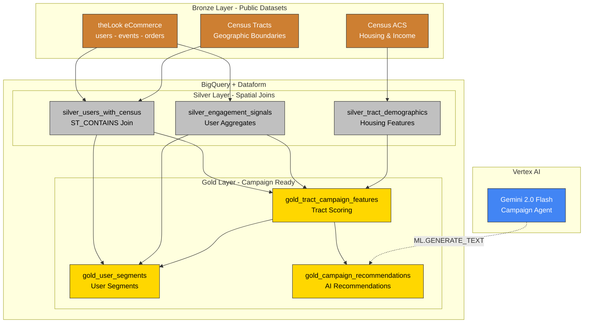
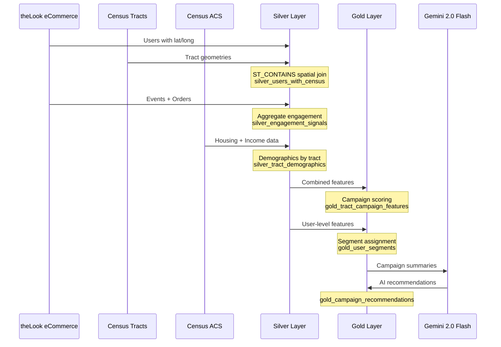

# Campaign Intelligence Architecture

Data flow and pipeline structure for AI-powered campaign targeting with Census data.

---

## Pipeline Overview



---

## Data Flow



---

## Key Components

| Layer | Table | Purpose |
|-------|-------|---------|
| Bronze | `thelook_users` | User demographics with lat/long |
| Bronze | `thelook_events` | Web events (page views, carts) |
| Bronze | `thelook_orders` | Purchase transactions |
| Bronze | `census_tracts` | Geographic tract boundaries |
| Bronze | `census_acs` | Housing tenure, income by tract |
| Silver | `silver_users_with_census` | Users joined to tracts via ST_CONTAINS |
| Silver | `silver_engagement_signals` | Aggregated digital engagement |
| Silver | `silver_tract_demographics` | Housing and income features |
| Gold | `gold_tract_campaign_features` | Campaign scoring by tract |
| Gold | `gold_user_segments` | User segments with propensity |
| Gold | `gold_campaign_recommendations` | AI-generated recommendations |

---

## Spatial Join

Users are mapped to census tracts using BigQuery's geography functions:

```sql
WHERE ST_CONTAINS(
  tracts.tract_geom,
  ST_GEOGPOINT(users.longitude, users.latitude)
)
```

This enables demographic enrichment without PII.

---

## Navigation

[Guide](guide.md) | [Quick Reference](quick.md) | [Patterns Reference](../../architecture.md)
