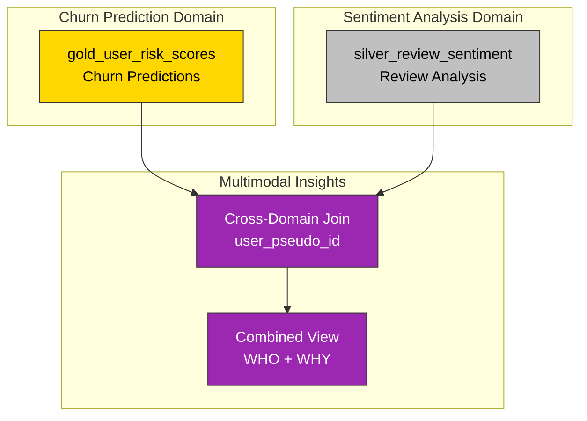
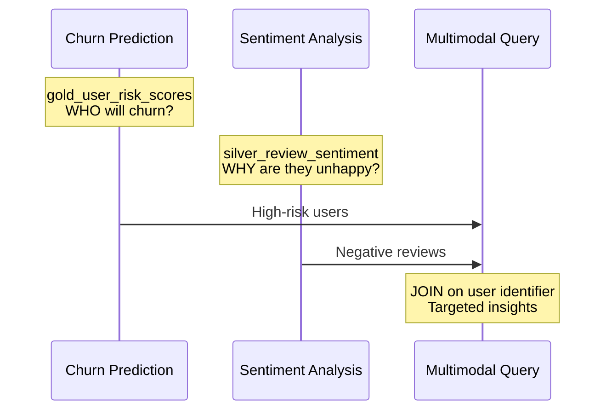

# Multimodal Insights Architecture

Data flow and pipeline structure for combining behavioral and sentiment signals.

---

## Pipeline Overview



---

## Data Flow



---

## Key Insight

This demo combines outputs from two independent pipelines:

| Signal | Source | Question Answered |
|--------|--------|-------------------|
| Behavioral | Churn Prediction | **WHO** is likely to leave? |
| Textual | Sentiment Analysis | **WHY** are they unhappy? |

The combination enables targeted action: prioritize high-risk users with specific complaints.

---

## Cross-Domain Query

```sql
SELECT
  risk.user_pseudo_id,
  risk.churn_probability,
  sentiment.sentiment,
  sentiment.category,
  sentiment.review_text
FROM gold_user_risk_scores risk
JOIN silver_review_sentiment sentiment
  ON risk.user_pseudo_id = sentiment.user_id
WHERE risk.churn_probability > 0.7
  AND sentiment.sentiment = 'negative'
ORDER BY risk.churn_probability DESC;
```

---

## Prerequisites

This demo requires both upstream pipelines to be complete:

1. **Churn Prediction** - `gold_user_risk_scores` must be populated
2. **Sentiment Analysis** - `silver_review_sentiment` must be populated

---

## Navigation

[Guide](guide.md) | [Patterns Reference](../../architecture.md)
