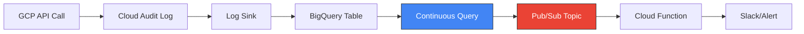

# Step 8: Real-Time Threat Alerts (Optional)

Enable continuous queries for instant threat detection with Pub/Sub integration.

> **This step is optional.** It requires enabling an additional Terraform flag (`enable_realtime_alerts = true`) which provisions an Enterprise reservation. The reservation incurs costs even when idle. See the [Google Cloud Pricing Calculator](https://cloud.google.com/products/calculator) for current rates.

---

## Overview

**Problem:** Security teams face a gap:
- Batch analytics (Steps 1-7): Great insights, but threats discovered hours/days later
- Real-time SIEM (Splunk, Sentinel): Expensive, specialized query languages, separate infrastructure

**Solution:** Your data warehouse is now a SIEM.

- Real-time AI threat detection with just SQL — no Kafka, no Flink, no SIEM license
- From log event to Pub/Sub alert in seconds, using BigQuery you already have

---

## Prerequisites

1. **Enterprise reservation enabled:**
   ```hcl
   # In terraform.tfvars
   enable_realtime_alerts = true
   ```

2. **Terraform applied:**
   ```bash
   cd infra && terraform apply
   ```

3. **Service account created** (automatic via Terraform):
   - `bq-continuous-queries@{project}.iam.gserviceaccount.com`

---

## Architecture



---

## Running the Demo

### 1. Start the Continuous Query

In BigQuery Console:

1. Paste the query below
2. Click **More** → **Query settings**:
   - Select `bq-continuous-queries@...` as the **Service account**
   - Set **Job timeout** to `3600000` milliseconds (1 hour)
3. Click **Save**
4. Click **More** → **Continuous query** → enable
5. Click **Run**

```sql
EXPORT DATA OPTIONS (
  format = 'CLOUD_PUBSUB',
  uri = 'https://pubsub.googleapis.com/projects/gcloud-tech-showcase/topics/security-alerts'
) AS (
  SELECT
    TO_JSON_STRING(STRUCT(
      timestamp,
      protopayload_auditlog.methodName AS method,
      protopayload_auditlog.serviceName AS service,
      protopayload_auditlog.authenticationInfo.principalEmail AS principal
    )) AS message
  FROM APPENDS(
    TABLE `gcloud-tech-showcase.security_logs.cloudaudit_googleapis_com_activity`,
    CURRENT_TIMESTAMP() - INTERVAL 10 MINUTE
  )
  WHERE
    -- Destructive operations
    protopayload_auditlog.methodName LIKE '%Delete%'
    OR protopayload_auditlog.methodName LIKE '%Remove%'
    -- IAM changes
    OR protopayload_auditlog.methodName LIKE '%SetIamPolicy%'
    OR protopayload_auditlog.methodName LIKE '%CreateServiceAccount%'
    OR protopayload_auditlog.methodName LIKE '%CreateServiceAccountKey%'
    -- Logging sink changes (defense evasion)
    OR protopayload_auditlog.methodName LIKE '%Sink%'
);
```

> **Note:** The job timeout is configured via Query Settings. This ensures the query auto-terminates after 1 hour, preventing unexpected costs.

### 2. Generate Security Events

```bash
cd scripts
source .venv/bin/activate

# Privilege escalation (creates service account)
python generate_security_logs.py --project gcloud-tech-showcase --scenario privesc --delay 0.5

# Defense evasion (creates/updates/deletes logging sink)
python generate_security_logs.py --project gcloud-tech-showcase --scenario defense-evasion --delay 0.5
```

### 3. Watch Events in Pub/Sub

Wait 30-60 seconds for audit log latency, then:

```bash
gcloud pubsub subscriptions pull security-alerts-sub \
  --project=gcloud-tech-showcase \
  --auto-ack \
  --limit=10
```

**Expected output:**
```json
{"timestamp":"2026-02-17T16:07:28Z","method":"CreateSink","service":"logging.googleapis.com","principal":"user@example.com"}
{"timestamp":"2026-02-17T16:07:30Z","method":"UpdateSink","service":"logging.googleapis.com","principal":"user@example.com"}
```

---

## Attack Scenarios (MITRE ATT&CK)

### Defense Evasion (TA0005)

**The Story:** An attacker who has gained access wants to hide their tracks by modifying or disabling logging.

| Step | Operation | Why It's Suspicious |
|------|-----------|---------------------|
| 1 | `CreateSink` | Creates a new log sink — could be exfiltrating logs to attacker-controlled destination |
| 2 | `UpdateSink` | Changes the filter to `severity>=WARNING` — now INFO-level activity isn't captured |
| 3 | `DeleteSink` | Removes the evidence of the sink they created |

**Real-world attack pattern:**
1. Attacker compromises a service account
2. Creates a sink to export logs to their own bucket (data exfil)
3. Modifies the org's main audit sink to exclude certain log types
4. Performs malicious actions (now not logged)
5. Deletes the exfil sink to cover tracks

**Why this matters:** `UpdateSink` changing a filter is a *huge* red flag — legitimate ops rarely modify audit log filters. Rapid create → update → delete pattern suggests covering tracks.

### Privilege Escalation (TA0004)

**The Story:** An attacker creates service accounts or keys to maintain access or escalate privileges.

| Operation | Why It's Suspicious |
|-----------|---------------------|
| `CreateServiceAccount` | New identity that could be used for persistence |
| `CreateServiceAccountKey` | Exportable credential — major exfil risk |
| `SetIamPolicy` | Granting permissions to attacker-controlled identity |

### Other High-Signal Events

- `%Delete%` — Destructive operations (resource deletion, data destruction)
- `%Remove%` — Removing access, memberships, or resources
- `%Sink%` — Any logging sink modification

---

## Cleanup

### Stop the Continuous Query

The query auto-terminates after 1 hour. To stop it earlier, find the running job in BigQuery Console and click **Cancel**, or use CLI:

```bash
bq cancel <job_id>
```

### Remove Demo Resources

```bash
python generate_security_logs.py --project gcloud-tech-showcase --cleanup
```

---

## Limitations

- **No JOINs** — each row processed independently
- **No aggregations** — can't do "3 events in 5 minutes" patterns
- **No window functions** — no rolling calculations
- **Enterprise edition required** — not available on on-demand
- **1-hour timeout** — the demo query uses a 1-hour timeout by default

**For per-event classification** — "is THIS event suspicious?" — continuous queries are perfect. For pattern detection — "3 failed logins in 5 minutes" — you still need batch. BigQuery handles both.

---

## Technical Requirements

### Reservation Requirements

- **Edition:** Enterprise or Enterprise Plus
- **Job type:** CONTINUOUS assignment
- **Slots:** 0 baseline + autoscale (min 50, must be multiple of 50)
- **No commitment required** — capacity pricing (pay-as-you-go)

### Service Account Permissions

The `bq-continuous-queries` service account needs:

| Role | Purpose |
|------|---------|
| `roles/bigquery.jobUser` | Run queries |
| `roles/bigquery.dataViewer` | Read tables |
| `roles/pubsub.publisher` | Publish to topic |
| `roles/pubsub.viewer` | Access topic schema |

Configure in BigQuery Console: **More** → **Query settings** → **Service account**

---

## Navigation

[← Step 7: Threat Patterns](guide.md#step-7-threat-pattern-library) | [Quick Reference](quick.md)
