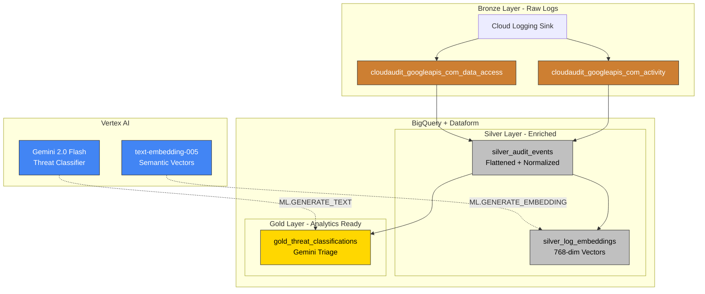
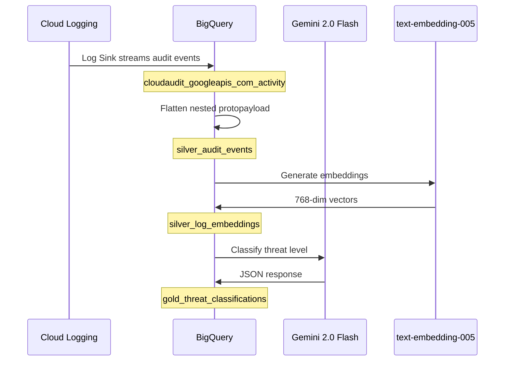

# Security Logs Architecture

Data flow and pipeline structure for AI-powered audit log analytics.

---

## Pipeline Overview

---

## Data Flow

---

## Key Components

| Layer | Table | Purpose |
|-------|-------|---------|
| Bronze | `cloudaudit_googleapis_com_activity` | Raw admin activity logs from sink |
| Bronze | `cloudaudit_googleapis_com_data_access` | Raw data access logs from sink |
| Silver | `silver_audit_events` | Flattened events with extracted fields |
| Silver | `silver_log_embeddings` | Semantic vectors for similarity search |
| Gold | `gold_threat_classifications` | AI-classified threats with explanations |

---

## AI Models

| Model | Type | Purpose |
|-------|------|---------|
| `gemini_log_analyst` | Remote (Gemini 2.0 Flash) | Threat classification and explanation |
| `text_embedding_model` | Remote (text-embedding-005) | Semantic embeddings for vector search |

---

## Navigation

[Guide](guide.md) | [Quick Reference](quick.md) | [Patterns Reference](../../architecture.md)
