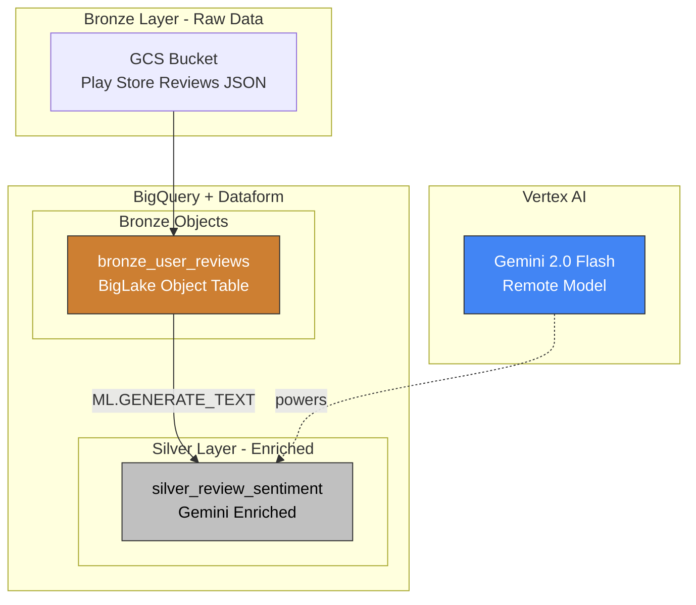
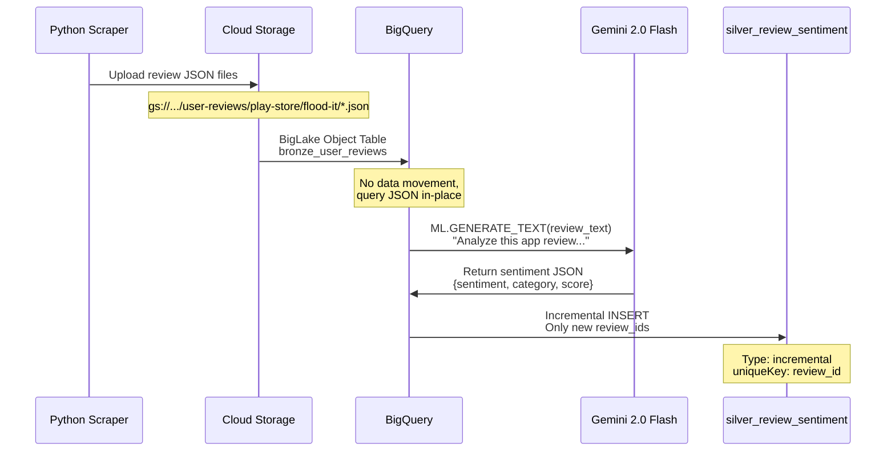

# Sentiment Analysis Architecture

Data flow and pipeline structure for AI-powered review analysis with Gemini.

---

## Pipeline Overview



---

## Data Flow



---

## Key Components

| Layer | Table | Purpose |
|-------|-------|---------|
| Bronze | `bronze_user_reviews` | BigLake Object Table for GCS JSON |
| Silver | `silver_review_sentiment` | Gemini-enriched reviews (incremental) |

---

## AI Model

| Model | Type | Purpose |
|-------|------|---------|
| `gemini_sentiment_model` | Remote (Gemini 2.0 Flash) | Sentiment classification with structured JSON output |

**Output fields:** sentiment (positive/negative/neutral), category (bug/feature/praise/complaint), confidence_score

---

## Incremental Processing

The `silver_review_sentiment` table uses Dataform's incremental mode:

```javascript
config {
  type: "incremental",
  uniqueKey: ["review_id"]
}
```

Only new reviews are processed on each run, avoiding duplicate Gemini API calls.

---

## Navigation

[Guide](01-enrichment.md) | [Quick Reference](quick.md) | [Patterns Reference](../../architecture.md)
