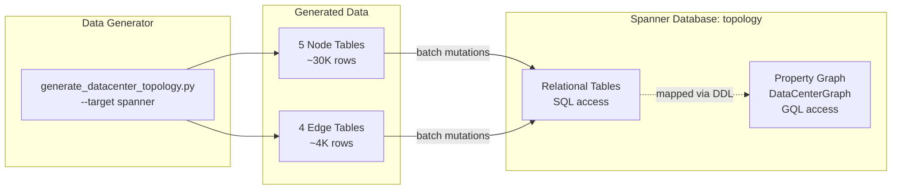
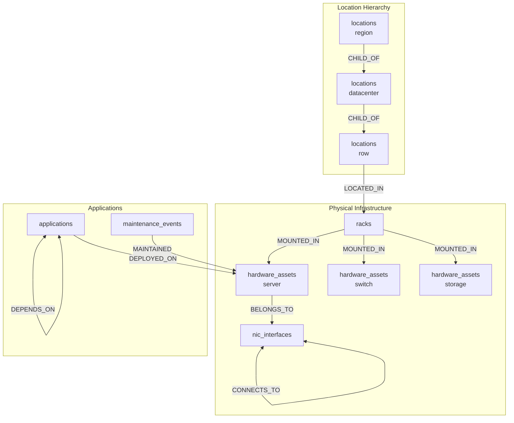

# Spanner Graph Architecture

## Overview

This demo uses Spanner Graph to model data center infrastructure as a property graph, enabling intuitive queries for impact analysis and dependency tracing.

## Data Flow

## Graph Schema

## Node Tables

| Table | Primary Key | Description | Sample Size |
|-------|-------------|-------------|-------------|
| `locations` | `location_id` | Hierarchical locations (regions, DCs, rows) | ~50 |
| `racks` | `rack_id` | Physical rack units | ~500 |
| `hardware_assets` | `asset_id` | Servers, switches, storage | ~6,000 |
| `nic_interfaces` | `interface_id` | Network interfaces/ports | ~24,000 |
| `applications` | `app_id` | Deployed software | ~200 |
| `maintenance_events` | `event_id` | Historical maintenance | ~2,500 |

## Edge Tables

| Table | Source | Destination | Label | Description |
|-------|--------|-------------|-------|-------------|
| `locations` | location | parent_location | CHILD_OF | Location hierarchy |
| `racks` | rack | location | LOCATED_IN | Rack placement |
| `hardware_assets` | asset | rack | MOUNTED_IN | Asset in rack |
| `nic_interfaces` | interface | asset | BELONGS_TO | NIC on asset |
| `network_connections` | source_nic | target_nic | CONNECTS_TO | Network links |
| `app_deployments` | app | asset | DEPLOYED_ON | App on server |
| `app_dependencies` | app | depends_on_app | DEPENDS_ON | App dependencies |
| `maintenance_events` | event | asset | MAINTAINED | Maintenance history |

## Infrastructure Components

| Component | Resource | Purpose |
|-----------|----------|---------|
| Spanner Instance | `data-center-graph` | Regional instance (100 PU minimum) |
| Spanner Database | `topology` | Contains tables and property graph |
| Property Graph | `DataCenterGraph` | Graph view over relational tables |

## Key Files

| File | Purpose |
|------|---------|
| `infra/spanner_graph.tf` | Terraform for Spanner instance, database, DDL |
| `infra/variables.tf` | Feature flag `enable_spanner_graph_demo` |
| `scripts/generate_datacenter_topology.py` | Data generator with `--target spanner` |

---

[Back to README](README.md) | [Quick Reference](quick.md) | [Full Guide](guide.md)
