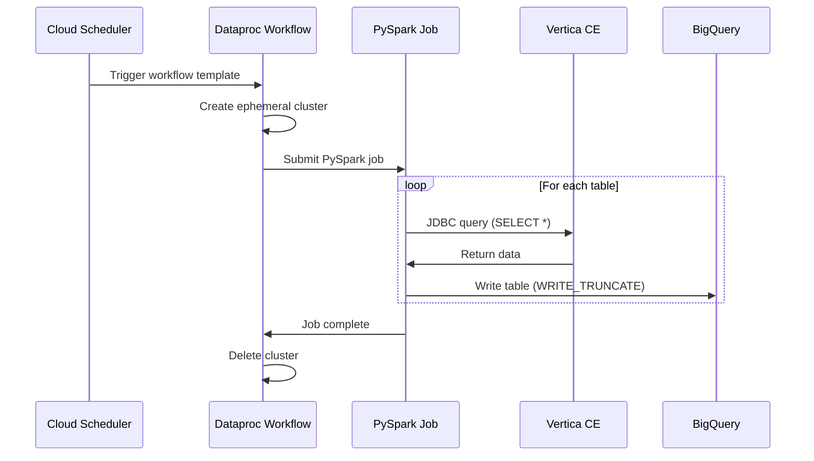

# Vertica Ingestion Architecture

Data flow and pipeline structure for Vertica-to-BigQuery migration.

---

## Pipeline Overview

```
┌─────────────────────────────────────────────────────────────────────────────┐
│                     VERTICA-TO-BIGQUERY INGESTION                           │
├─────────────────────────────────────────────────────────────────────────────┤
│                                                                             │
│  ┌─────────────────┐         ┌─────────────────┐                           │
│  │ Vertica CE      │         │ Dataproc        │                           │
│  │ (Docker on VM)  │ ──────► │ (PySpark Job)   │                           │
│  │ jbfavre:9.2.0-7 │  JDBC   │ Ephemeral       │                           │
│  └─────────────────┘         └────────┬────────┘                           │
│                                       │                                     │
│                                       ▼                                     │
│  ┌─────────────────────────────────────────────────────────────────────┐   │
│  │                    BigQuery: data_center_topology                    │   │
│  │  ┌──────────────────────────────────────────────────────────────┐   │   │
│  │  │ Entity Tables               │ Relationship Tables            │   │   │
│  │  │ - locations                 │ - network_connections          │   │   │
│  │  │ - racks                     │ - app_deployments              │   │   │
│  │  │ - hardware_assets           │ - app_dependencies             │   │   │
│  │  │ - nic_interfaces            │ - maintenance_events           │   │   │
│  │  │ - applications              │                                │   │   │
│  │  └──────────────────────────────────────────────────────────────┘   │   │
│  └─────────────────────────────────────────────────────────────────────┘   │
│                                                                             │
└─────────────────────────────────────────────────────────────────────────────┘
```

---

## Data Flow



---

## Infrastructure Components

| Component | Resource | Purpose |
|-----------|----------|---------|
| **Vertica VM** | `google_compute_instance.vertica` | Hosts Vertica CE in Docker container |
| **Workflow Template** | `google_dataproc_workflow_template.vertica_to_bq` | Defines ephemeral cluster + job |
| **Scheduler Job** | `google_cloud_scheduler_job.vertica_sync` | Weekly trigger (paused by default) |
| **Spark Scripts Bucket** | `google_storage_bucket.spark_scripts` | Stores PySpark job files |
| **Staging Bucket** | `google_storage_bucket.vertica_staging` | Temporary storage for Spark |

---

## Network Security

All resources use internal IPs only:

```
┌────────────────────────────────────────────────────────────┐
│                     VPC: data-cloud-vpc                    │
│                                                            │
│  ┌──────────────┐     ┌──────────────┐                    │
│  │ Vertica VM   │     │ Dataproc     │                    │
│  │ 10.0.0.x     │◄───►│ 10.0.0.x     │                    │
│  │ (internal)   │JDBC │ (internal)   │                    │
│  └──────────────┘     └──────────────┘                    │
│         ▲                                                  │
│         │ IAP Tunnel                                       │
│         │ (TCP 22)                                         │
└─────────┼──────────────────────────────────────────────────┘
          │
    ┌─────┴─────┐
    │ Developer │
    │ Workstation│
    └───────────┘
```

**Firewall Rules:**
- `allow-iap-ssh` — IAP IP range (35.235.240.0/20) to VMs on port 22
- `allow-dataproc-internal` — All TCP/UDP/ICMP within subnet for Dataproc clusters

---

## Version Compatibility

| Component | Version | Notes |
|-----------|---------|-------|
| Vertica Server | 9.2.0-7 CE | jbfavre/vertica Docker image |
| Vertica JDBC Driver | 12.0.4-0 | Standard JDBC, works with Vertica 9.x |
| Dataproc Image | 2.1-debian11 | Spark 3.3.x, Scala 2.12 |
| BigQuery Connector | Built-in | Pre-installed on Dataproc 2.1+ |

---

## Key Files

| File | Purpose |
|------|---------|
| `infra/vertica_ingestion.tf` | VM, Dataproc, Scheduler, firewall rules |
| `infra/data_center_topology.tf` | BigQuery dataset |
| `infra/scripts/vertica-install.sh` | VM startup script |
| `scripts/spark/vertica_to_bigquery.py` | PySpark ingestion job |
| `scripts/generate_datacenter_topology.py` | Data generator |

---

## Navigation

[Guide](guide.md) | [Quick Reference](quick.md) | [Back to Demos](../README.md)
