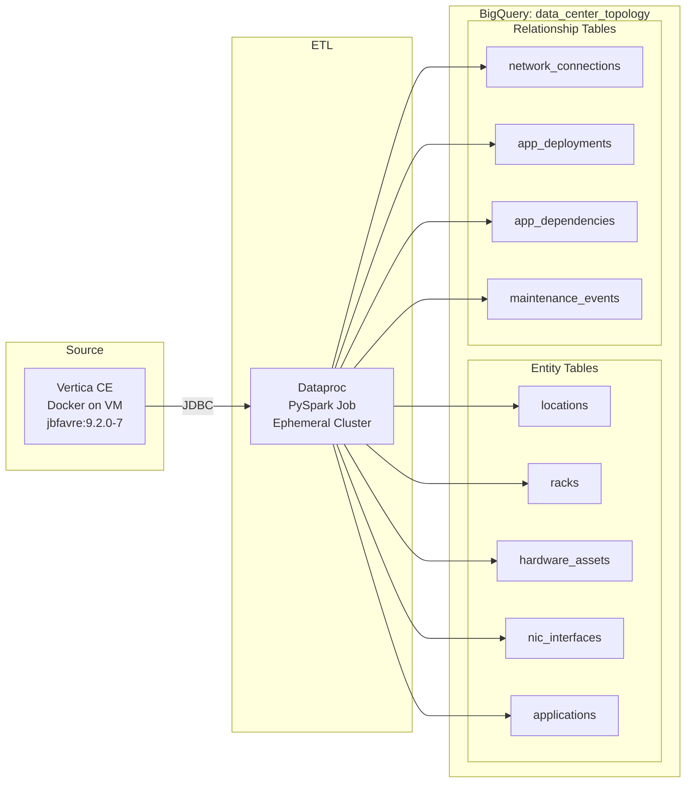
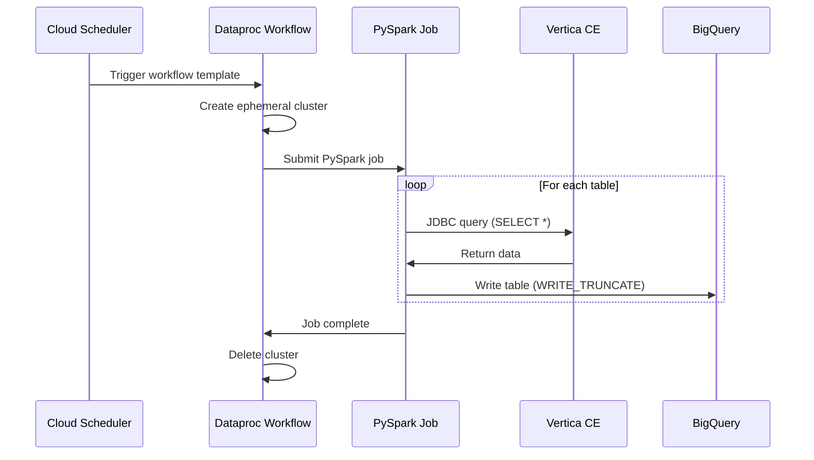
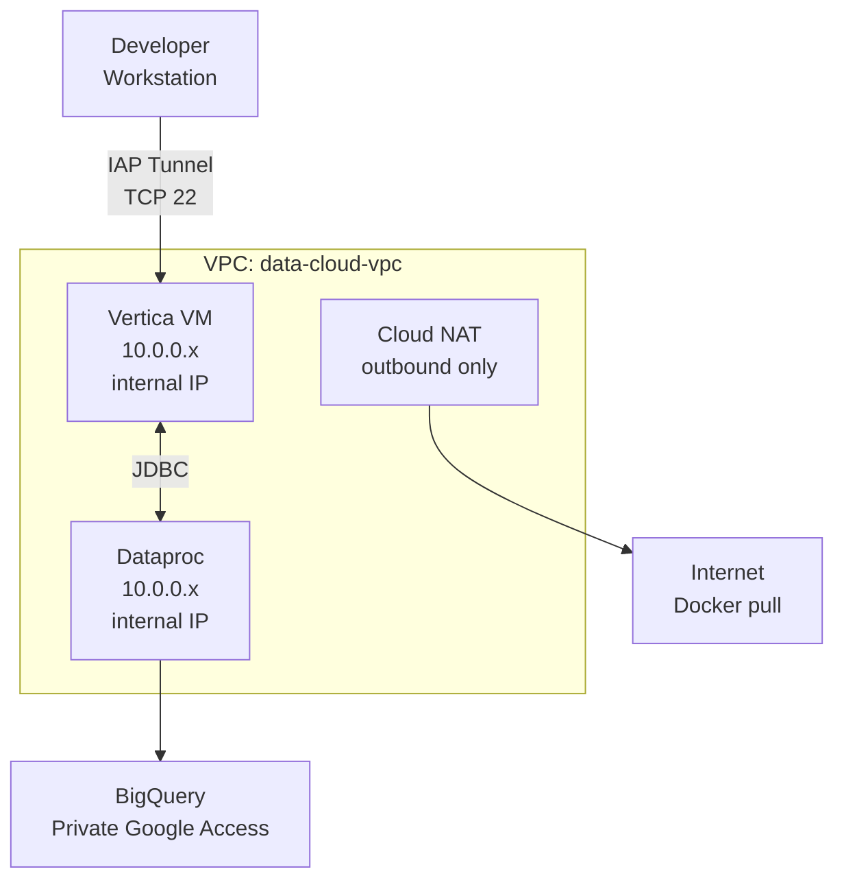

# Vertica Ingestion Architecture

Data flow and pipeline structure for Vertica-to-BigQuery migration.

---

## Pipeline Overview

---

## Data Flow

---

## Infrastructure Components

### Compute

| Component | Terraform Resource | Purpose |
|-----------|-------------------|---------|
| Vertica VM | `google_compute_instance.vertica` | CentOS Stream 9 with Docker, hosts Vertica CE |
| Workflow Template | `google_dataproc_workflow_template.vertica_to_bq` | Ephemeral Dataproc cluster + PySpark job |
| Scheduler Job | `google_cloud_scheduler_job.vertica_sync` | Weekly trigger (paused by default) |

### Storage

| Component | Terraform Resource | Purpose |
|-----------|-------------------|---------|
| BigQuery Dataset | `google_bigquery_dataset.data_center_topology` | Target for ingested tables |
| Spark Scripts Bucket | `google_storage_bucket.spark_scripts` | Stores PySpark job file |
| Staging Bucket | `google_storage_bucket.vertica_staging` | Temporary storage for Spark |

### Networking

| Component | Terraform Resource | Purpose |
|-----------|-------------------|---------|
| Cloud Router | `google_compute_router.main` | Routes traffic for NAT |
| Cloud NAT | `google_compute_router_nat.main` | Outbound internet for VMs with no external IP |
| IAP Firewall | `google_compute_firewall.vertica_iap_ssh` | SSH access via IAP (35.235.240.0/20) |
| Vertica Firewall | `google_compute_firewall.vertica_internal` | Port 5433 within subnet |
| Dataproc Firewall | `google_compute_firewall.dataproc_internal` | All TCP/UDP/ICMP within subnet |

### Service Accounts

| Account | Purpose |
|---------|---------|
| `vertica-demo-vm` | Vertica VM identity |
| `dataproc-vertica-ingestion` | Dataproc cluster + BigQuery writer |
| `scheduler-vertica-ingestion` | Cloud Scheduler workflow trigger |

---

## Network Topology

All resources use internal IPs only (org policy compliant):

**Key security features:**
- No external IPs on any compute resources
- IAP for SSH access (no bastion host needed)
- Cloud NAT for outbound-only internet (Docker image pull)
- Private Google Access for BigQuery API

---

## Version Compatibility

| Component | Version | Notes |
|-----------|---------|-------|
| Vertica Server | 9.2.0-7 CE | jbfavre/vertica Docker image |
| Vertica JDBC Driver | 12.0.4-0 | Standard JDBC, works with Vertica 9.x |
| Dataproc Image | 2.1-debian11 | Spark 3.3.x, Scala 2.12 |
| BigQuery Connector | Built-in | Pre-installed on Dataproc 2.1+ |

---

## Key Files

| File | Purpose |
|------|---------|
| `infra/vertica_ingestion.tf` | VM, Dataproc, Scheduler, firewall, service accounts |
| `infra/data_center_topology.tf` | BigQuery dataset |
| `infra/core.tf` | Cloud Router, Cloud NAT, VPC |
| `infra/scripts/vertica-install.sh` | VM startup script (Docker + Vertica) |
| `scripts/spark/vertica_to_bigquery.py` | PySpark ingestion job |
| `scripts/generate_datacenter_topology.py` | Data generator |

---

## Navigation

[Guide](guide.md) | [Quick Reference](quick.md) | [Back to Demos](../README.md)
