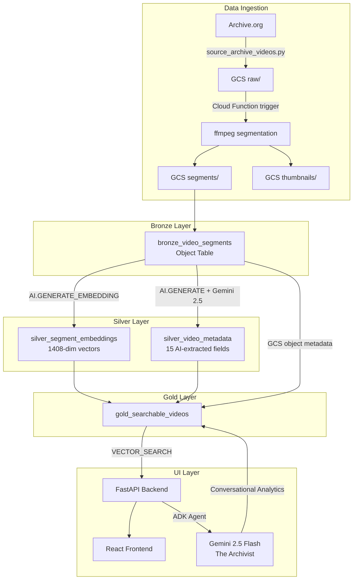
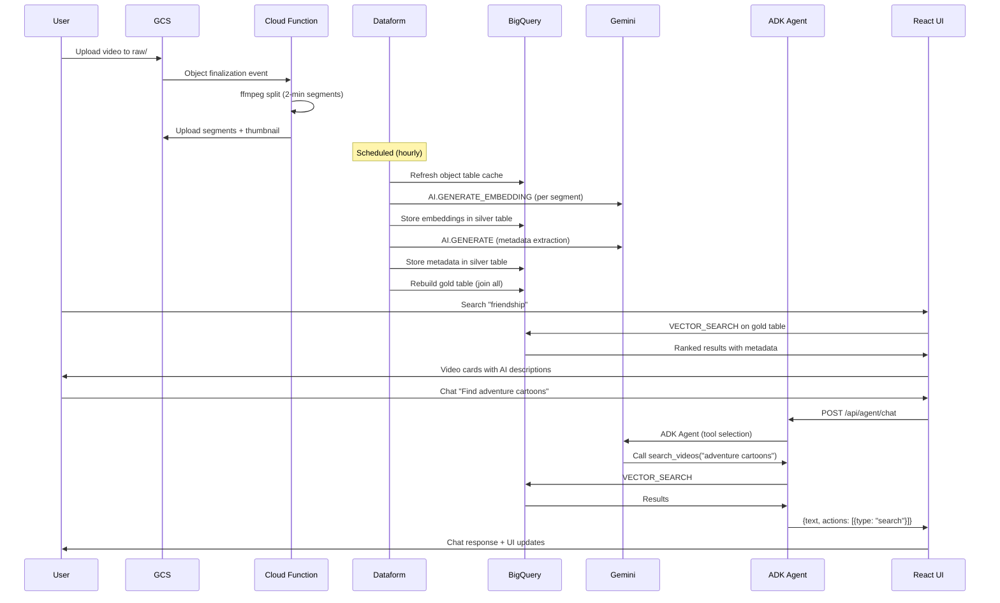

# Video Vector Search Architecture

Data flow and pipeline structure for semantic video search.

---

## Pipeline Overview

---

## Data Flow

---

## Key Components

| Layer | Table/Resource | Type | Purpose |
|-------|---------------|------|---------|
| Bronze | `bronze_video_segments` | Object Table (SIMPLE) | GCS video segments queryable via SQL |
| Model | `multimodal_embedding_model` | Remote Model | `multimodalembedding@001` for video/text embeddings |
| Model | `gemini_video_model` | Remote Model | Gemini 2.5 Flash for AI metadata extraction |
| Silver | `silver_segment_embeddings` | Incremental Table | 1408-dim embeddings per segment interval |
| Silver | `silver_video_metadata` | Incremental Table | 15 AI-extracted fields per video |
| Gold | `gold_searchable_videos` | Table | Embeddings + GCS metadata + AI metadata joined |
| Agent | The Archivist (ADK) | LlmAgent | Conversational assistant with 9 tools (Gemini 2.5 Flash) |

---

## AI Models

| Model | Endpoint | Purpose | Input |
|-------|----------|---------|-------|
| Multimodal Embedding | `multimodalembedding@001` | Cross-modal vector embeddings | Video segments (16s intervals) |
| Gemini 2.5 Flash | `gemini-2.5-flash` | Structured metadata extraction | Video segment 0 via `AI.GENERATE` |
| Gemini 2.5 Flash | `gemini-2.5-flash` | Agent reasoning + tool use | Natural language via ADK Agent (runtime) |
| Conversational Analytics | `geminidataanalytics` | NL-to-SQL on video metadata | Agent `query_metadata` tool |

---

## Key Technical Details

- **2-minute segment limit**: `AI.GENERATE_EMBEDDING` analyzes max 120 seconds per video. Videos are split into 2-min segments; results grouped by parent video at query time.
- **GCS object metadata**: Title, year, timing info stored as custom metadata on each segment GCS object. Extracted in gold table via `UNNEST(metadata)`.
- **Incremental processing**: Silver tables use `type: "incremental"` with `uniqueKey` — only new segments/videos are processed on each Dataform run.
- **Object table cache**: `AUTOMATIC` mode with 30-minute staleness. New segments visible within 30 minutes.
- **Cross-modal search**: Text queries search against video embeddings because `multimodalembedding@001` encodes both modalities in the same vector space.
- **Vector indexing**: Not enabled — brute-force scan is fast enough at this scale (~4K rows). For larger libraries, create a [vector index](https://cloud.google.com/bigquery/docs/vector-index) on `gold_searchable_videos.embedding` to accelerate `VECTOR_SEARCH` queries.

---

## Infrastructure (Terraform)

| Resource | Purpose |
|----------|---------|
| `google_bigquery_dataset.video_vector_search` | BQ dataset |
| `google_storage_bucket.video_search` | GCS bucket for all video data |
| `google_cloudfunctions2_function.segment_video` | Auto-segmentation on upload |
| `google_service_account.video_segmenter` | SA for Cloud Function + Dataform execution |
| `google_bigquery_dataset_iam_member.segmenter_bq_data_editor` | Dataform write access (scoped to dataset) |
| `google_dataform_repository_workflow_config.video_search` | Scheduled hourly Dataform execution (uses shared release config) |
| `local_file.video_search_api_env` | Generated `.env` for local API development |
| `google_cloud_run_v2_service.video_search_ui` | Cloud Run UI deployment (optional, `enable_video_search_ui`) |
| `google_service_account.video_search_ui` | SA for Cloud Run with BQ, GCS, and Vertex AI access |
| `google_project_iam_member.ui_vertex_ai_user` | Cloud Run SA access to Gemini via Vertex AI |
| `google_vertex_ai_reasoning_engine.the_archivist` | Agent Engine deployment (optional, `enable_agent_engine`) |
| `google_service_account.agent_engine` | SA for Agent Engine with BQ and Vertex AI access |

---

## Navigation

[Guide](guide.md) | [Quick Reference](quick.md) | [Patterns Reference](../../architecture.md)
